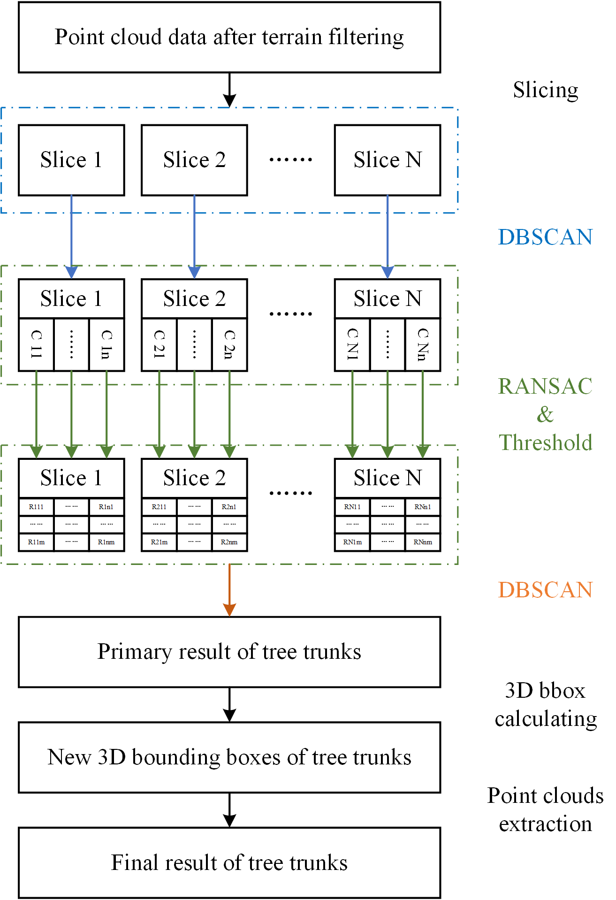

# Assignment 02: Trunk Detection
Individual tree trunk detection from point clouds using RANSAC.

## Background
Tree trunks have a significant shape feature – its shape is close to circle. 
Hence, they can be detected by 
1. slicing point clouds along the z axis
2. projecting point clouds in each slice onto the x-y plane.
3. then detecting tree trunks in every slice by the shape feature.

## Workflow
### 1. Data preprocessing: terrain filtering
The raw point clouds include both ground and non-ground points, 
thus we need to remove ground points from the entire data at first.

Here, we can use [Cloth Simulation Filter (CSF) tool](https://www.cloudcompare.org/doc/wiki/index.php/CSF_(plugin)) 
included in [CloudCompare](https://www.danielgm.net/cc/) to achieve that.

### 2. Tree trunk detection
The whole workflow of tree trunk detection is illustrated as follows.


#### 2.1 slice data by z values
Tree crowns are very close and even merge with each other. Hence, at first, we need to
slice the data based on the elevation (z) values to help us find tree trunks.

Default `slice_num = 30` with `max_zvalue = 20`
```shell
$ cd 02-tree_trunk_det # enter the directory '02-tree_trunk_det'
$ python -m p1_slice_data --cloud_path './Data/off-ground points.pcd' --save_dir ./Data/slice
```

#### 2.2 DBSCAN to group points
In every slice, the density-based spatial clustering of applications with noise (DBSCAN)
clustering algorithm was used to group points with their spatial neighbors together.  
In the DBSCAN process, only x and y values are considered.

Default `eps = 0.15` with `min_pts = 5` for DBSCAN
```shell
$ python -m p2_dbscan --slice_dir ./Data/slice --db_save_dir ./Data/results/numSlice30_zMax20
```

#### 2.3 RANSAC to get circles in each slice
In every DBSCAN cluster, RANSAC for circle detection was used to find the best circle that the points can fit. 
Repeat this step to get all circles in a slice.

Default `max_iter = 50` with `threshold_dis = 0.1` for RANSAC
```shell
$ python -m p3_ransac --dbscan_dir ./Data/results/numSlice30_zMax20 --rans_save_dir ./Data/results/numSlice30_zMax20_rans
```

#### 2.4 clean circles from RANSAC
In every slice, the result after RANSAC still contains some noise circles like fences. 
These noise circles have a large circle radius because they are close to a line. 

By using the man-made parameters:
1. radius threshold $T_r=2$
2. point number threshold $T_{pn}=500$ (50 for <=5 slices)

The wrongly detected circles are removed. 

:warning: ***Note:*** *only slices from 0 to 10 are considered in default.*
```shell
$ python -m p4_clean_circles --ransac_dir ./Data/results/numSlice30_zMax20_rans
```

#### 2.5 DBSCAN again to get the cluster of tree trunks
After getting the cleaned RANSAC results of every slice, 
DBSCAN is used again to cluster points by center x and center y values of circles.

The cluster result can combine the RANSAC results from every slice together. 
And this result will be used to get the final result of tree trunk detection.

Default `eps = 0.3` with `min_pts = 2` for DBSCAN (merge trunk slices)
```shell
$ python -m p5_get_trunks_A --ransac_dir ./Data/results/numSlice30_zMax20_rans
```

#### 2.6 get ultimate trunks by expanding the 3D bbox of preliminary trunks
After calculating the 3D bounding box of every cluster from step 2.5, 
1. we expanded the z-value range of every 3D bounding box to the maximum and minimum z values of the whole clusters.
2. the x-value and y-value range of every 3D bounding box were expanded by man-made parameters Ex=0.2, Ey=0.2.

These expanded 3D bounding boxes were the final bounding boxes of tree trunks. 
Point clouds in them were extracted and regarded as the result of tree trunk detection.
```shell
$ python -m p6_get_trunks_B --ransac_dir ./Data/results/numSlice30_zMax20_rans
```

The final result can show us the location, shape and range of every tree trunk.


### 3. Run all sub-steps together
The script running the wholeworkflow including all 6 sub-steps is also provided.  
All parameters of each sub-step can be set in the config file.

Following the default parameter setting, an example of config file and its corresponding cmd are as follows.
```shell
$ python -m main_wholeworkflow --config_path ./configs/cfg_trunkdet.ymls
```


## Tips
1. Different parameters of each step can be tried to get a better result.
2. You can check the .csv result of each middle-step by [CloudCompare](https://www.danielgm.net/cc/), 
with setting all columns except (x,y,z) as Scalar field when inputting.


## Exampled detection result
The detection result is illustrated below, 
with the left image displaying the bottom view and the right displaying the side view.

<p align = "center">    


</p>

## Requirement
The following core libraries are required. You can install them by `pip`.
- Numpy 
- Pandas
- tqdm
- open3d
- pyntcloud
- scikit-learn
- pyyaml

The used version of the required libraries in test environment is also provided as below.
- numpy==1.21.2
- open3d==0.14.1
- pandas==1.3.3
- pyntcloud==0.3.1
- PyYAML==6.0.2
- scikit_learn==1.0.2
- tqdm==4.62.3


## FAQs

**Q1:** *AttributeError: 'DataFrame' object has no attribute 'append'*

**A1:** The codes are test on `pandas=1.3.3`, where the 'append' attribute is still supported. 
In newer pandas version, the `append` has been removed.  
You can replace it with `concat` method. 

**Q2:** *The final detection results seem not right as shown in the example figure*

**A1:** When loading the `*newclass_finclass_.csv` file in CloudCompare,
(1) skip the first row (as it's the header saving the column names).
(2) except the top three columns (x,y,z) set all columns as `Scaler Field`, where the *final classification result* is the last column.
(3) active the `finclass` scaler field at the  *properties* GUI element in CloudCompare.  
Then you will see the final classification result.


## License
[MIT License](../LICENSE)